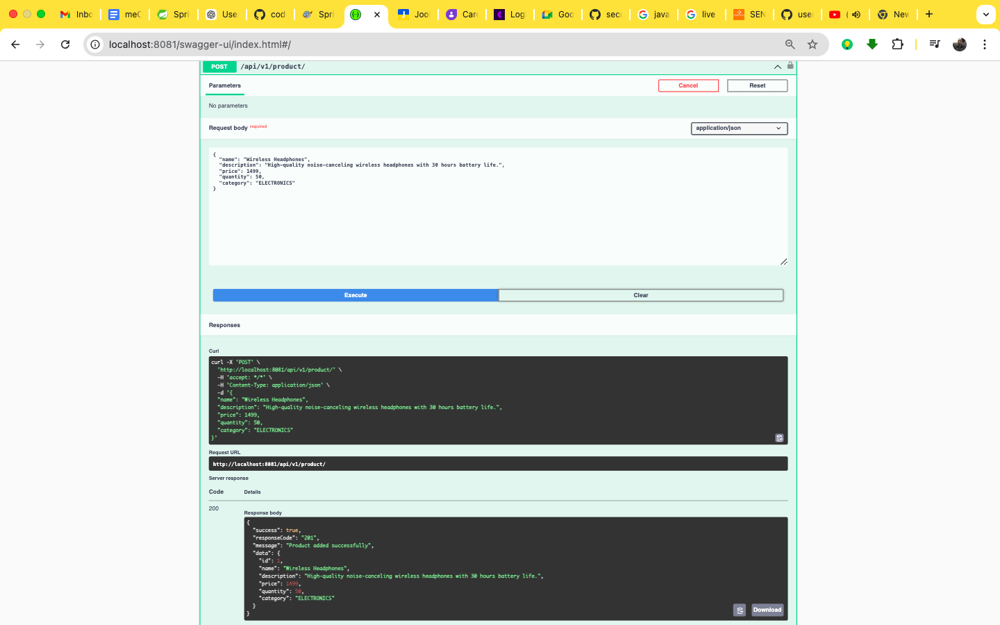
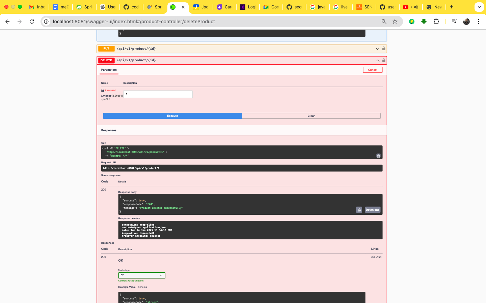
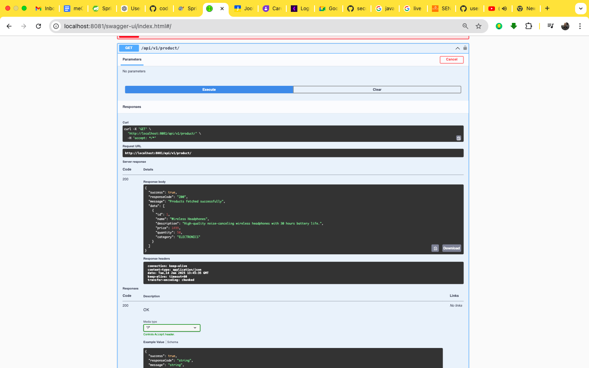
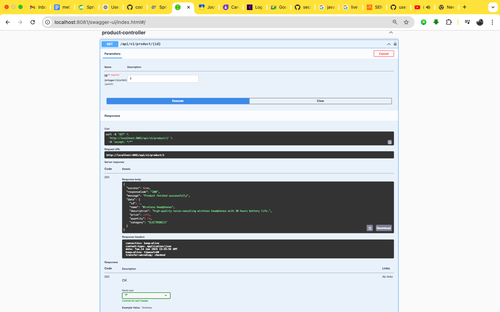

<!-- TABLE OF CONTENTS -->
<details>
  <summary>Table of Contents</summary>
  <ol>
    <li><a href="#about-the-project">About The Project</a></li>
    <li><a href="#built-with">Built With</a></li>
    <li><a href="#getting-started">Getting Started</a></li>
    <li><a href="#featuresusage">Features/Usage</a></li>
    <li><a href="#sample-test">Sample Test</a></li>
    <li><a href="#sample-data-persisting-db">Sample Data Persisting DB</a></li>
    <li><a href="#contact">Contact</a></li>
  </ol>
</details>

<!-- ABOUT THE PROJECT -->
## About The Project







[](endpoint_swagger.png)

# TM STORE Microservices Architecture

The **TM STORE** project implements a modern **microservices architecture** to provide scalable and efficient product and order management solutions. It offers functionalities for product management, order services, and integrates with other services through a secure API gateway.

---

## Services Overview

### 1. **Product Management Service**
- **Port**: `8081`
- Manages products, including adding, updating, and retrieving products.
- Handles the product data and communicates with other services.

### 2. **Order Service**
- **Port**: `8082`
- Manages order creation, updates, and tracking.
- Handles the relationship between orders and products.

### 3. **API Gateway (apigw)**
- **Port**: `8761`
- Serves as the centralized entry point for client requests.
- Routes requests to the appropriate microservices securely and efficiently.

### 4. **Discovery Server (myserver)**
- **Port**: `8761`
- Acts as the Eureka service registry for dynamic service discovery.
- Enables load balancing and fault tolerance.

---

## Built With

- **Java 17**
- **Spring Boot**
- **Spring Cloud Gateway**
- **Spring Data JPA**
- **Spring Security**
- **OpenFeign**
- **Spring Cloud Netflix Eureka**
- **MySql**
- **Lombok**
- **Docker**
- **Maven**
- **Swagger**

---

## System Architecture

The **TM STORE** system employs a microservices architecture, where each service is specialized for a specific domain. These services communicate through REST APIs, with service discovery facilitated by Eureka Server. OpenFeign simplifies inter-service communication.

### Ports and Service Mapping
| Service                       | Port |
|-------------------------------|------|
| Product Management Service     | 8081 |
| Order Service                  | 8082 |
| API Gateway (apigw)            | 8761 |
| Eureka Discovery Server        | 8761 |


---

## Getting Started

Follow the steps below to set up and run the system locally.

### Prerequisites

- **Java 17**
- **Maven**
- **Docker** (optional for containerized deployment)
- **MySql**

### Installation

1. Clone the repository:
   ```bash
   git clone https://github.com/code-with-sunday/TM_STORE
### Step 2: Build the Project

1. Navigate to the root directory of the cloned repository:
   ```bash

### Step 3: Build all services using Maven:
 ```bash
     mvn clean install


Contact
Sunday Peter

LinkedIn: linkedin.com/in/sundaypeter1
Email: sundaypetersp12@gmail.com
WhatsApp: +234 8186707807
